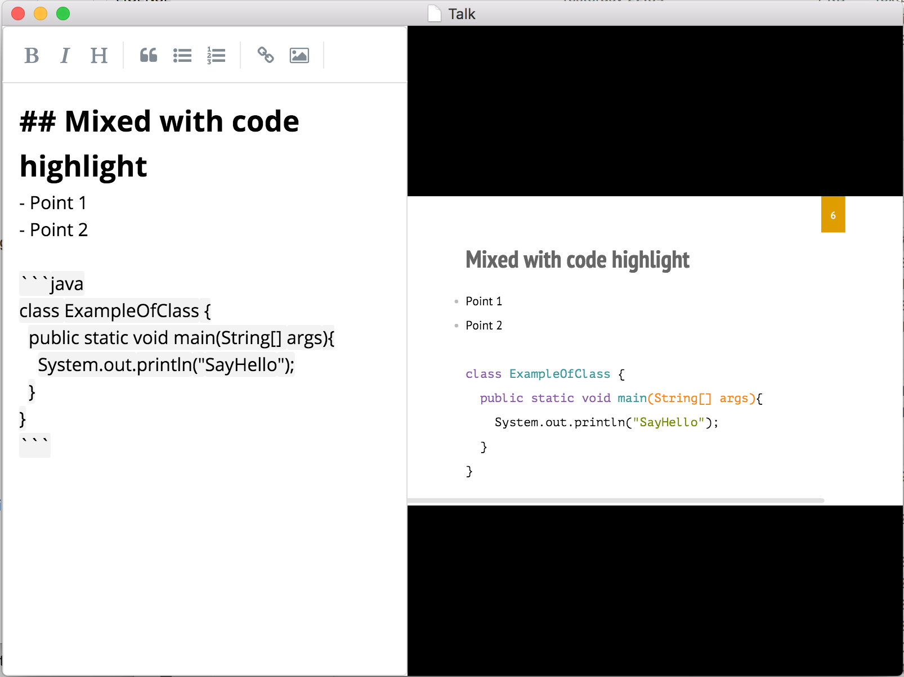

<p align="center">
	
	<h1>Talk: minimal standalone keynote software using HTML5 rendering and Markdown editing</h1>
</p>

This application allows you to edit and present slides rendered in HTML5 than you can edit in markdown for simplicity. Developed as a standalone application, TalkApp allows to focus on content editing while offering a very flexible way to export slide in pure HTML in your website. The embedded chromium presentation engine using electron framework allows to have a consistent and constant rendering needed for professional presentation. The syntax is pure markdown, with ability to add pure HTML when needed.

## Download:

Please have a look at the Release page of this repository: https://github.com/dukeboard/talk-app/releases 

## Features:
- Fast!
- Markdown slides syntax
- Nice editor with TAB and CTRL+TAB management for efficient list management
- Code syntax highlighting (Java, JS, C...)
- SpellChecker embedded
- HTML5 rendering using shower framework
- Export to HTML ability
- Export to PDF ability *(to come)*
- Fullscreen presentation mode
- Git friendly serialisation format

## Screenshot:

Opened on editor mode...



## Minimal documentation:

> CMD = COMMAND on mac or CTRL on window

### On editor:
- **CMD+N**: New document
- **CMD+O**: Open document
- **CMD+E**: Toggle edit mode
- **CMD+F**: Toggle fullscreen mode 
- **CMD+S**: Save document
- **CMD+UP**: Create a new slide above
- **CMD+DOWN**: Create a new slide below

### On slides:
- **Esc**: Toggle list or full-size mode
- **Left**: Go to slide left
- **Right**: Go to slide right

### Images and resources:

Image can be inserted with markdown or html syntax

```html

```

Nota bene, the **$ROOT** keyword allows to reference an image relatively to the place of saved .talk file. The best is then to create a directory for your presentation, save and `.talk` file and put images aside it. An example is better than a long speech so checkout the `example` directory of this repository to have a running starting project.

In addition users, can drop image and past image from OS clipboard directly into the left editor panel. In this case TalkApp will create automatically a copy of this image in a $ROOT/images/imported-DATE and insert the corresponding adress in the editor text. Of course this fonctionality ony work once the file as been saved or opened from somewhere.

### Export as HTML

The presentation can be exported as a flat HTML file that can be embedded in any static web site. The only dependency to this HTML file is images included.

# State

*beta*, actually all functionalities are working but some fuzzy refresh problem can occur. A simple app resize solve it temporary. More to come...
