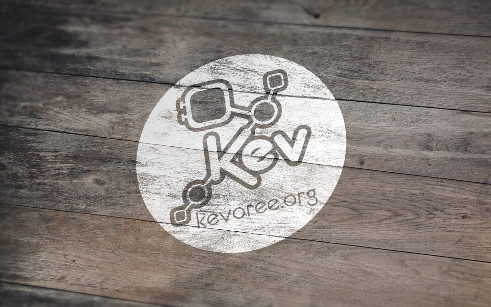
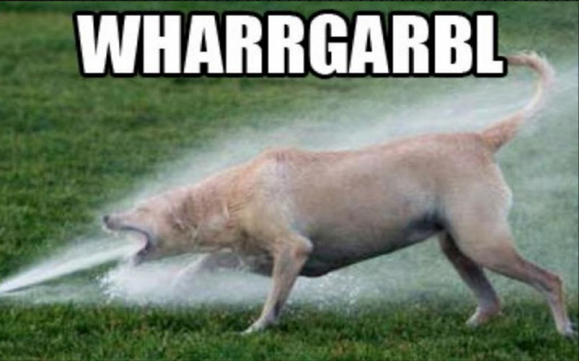
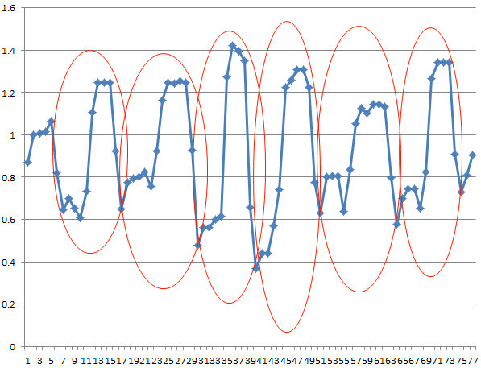

# Hello <!-- {.shout} -->

TODO


---



## **Talk**

---
## Overview

- Element **One**
- **Second** is also important
 - Important *sub* technology
 - Important to notice as well...

> Citation about the important goal!

---
<h2>Plain HTML can be used as well!<h2/>



---
## Mixed markdown and HTML
<ul>
		<li>Point 1</li>
		<li>Point 2</li>
</ul>



---
<!--{}-->
## Distraction free keynote!

---
## Mixed with code highlight
- Point 1
- Point 2

```java
class ExampleOfClass {
  public static void main(String[] args){
    System.out.println("SayHello");
  }
}
```

**lkcqdjlkfjs**


darkSlide
greenSlide
redSlide
yellowSlide
greySlide

---

## To be continued

> The very important citation

...more to come!  

code and travel ! :fa-subway:
